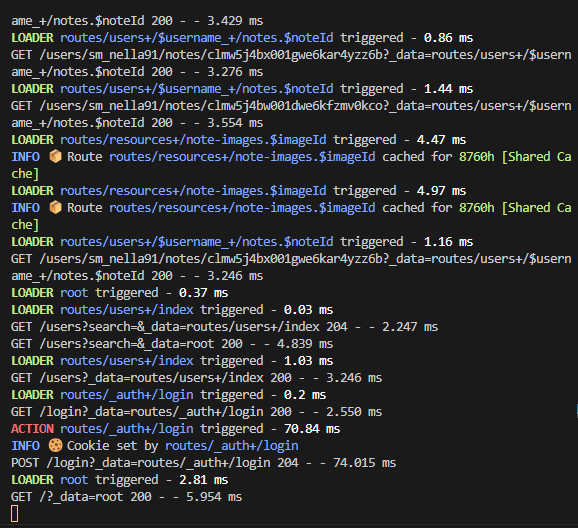
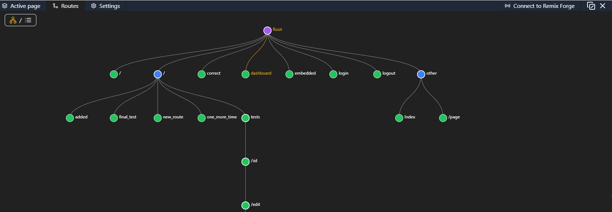
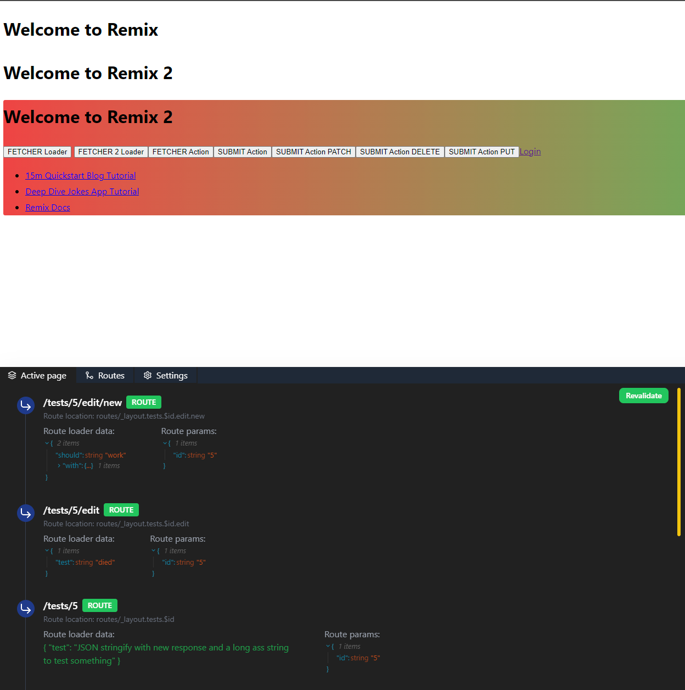

<p align="center">

</p>

# Remix Development Tools


 
 

Remix Development Tools is an open-source package designed to enhance your development workflow when working with Remix, a full-stack JavaScript framework for building web applications. This package provides a user-friendly interface consisting of three tabs, **Active Page**, **Terminal**, **Settings** and **Routes**, along with a side tab called **Timeline**. With Remix Development Tools, you can efficiently monitor and manage various aspects of your Remix projects, including page information, URL parameters, server responses, loader data, routes, and more.

## How it looks
### Server logger
 
### Routes Tab (List view)


### Routes Tab (Tree view)

### Timeline

### Route boundaries & Active page panel

## What's new?

## v3.0.0
Remix Development Tools v3.0.0 is here! This release brings a lot of new features and improvements to the Remix Development Tools. The most notable ones are:
1. The setup is completely changed (Check the getting started section for more info) 
2. The new dev tools are now a lot more stable and reliable. We have fixed a lot of bugs and improved the overall stability of the dev tools.
3. New server logger and server side listeners.
4. New rdt dev server
## v2.4.0
- Route boundaries locked behind a feature flag
- Panel position settings allow you to change the panel position to either top or bottom of the screen
- ErrorBoundaries are more precise now
## v2.3.0 
Route tree view support!
View all your routes in a node tree! You can also open routes in your browser from the tree view.
## v2.2.0
Embedded mode support!
Embed your dev tools wherever you want in your app by importing EmbeddedDevTools from the package!
## v2.1.3
- Deferred data support! You can see your deferred data in the active page tab now being loaded and swapped in realtime
- Settings option to change the default expansion level of json viewer (Default: 0)
### v2.1.0
 Detached mode support!


Json viewer improvements:
- Number of items in objects/arrays
- Copy to clipboard
- type of the value
- Doesn't close on revalidate anymore
- Different UI

# Features

## Server

Here are features offered on the server side of Remix Development Tools:
- Loader logs -> logs loader triggers and execution timing (from the moment the loader is triggered to the moment it finishes)
- Action logs -> logs action triggers and execution timing (from the moment the action is triggered to the moment it finishes)
- Cache logs -> logs your caching strategies that you define in your loaders/actions
- Cookie logs -> logs when you set cookies in your loaders/actions
- Defer support -> tells you which keys are deferred and how long it took for them to resolve
- Server side listeners -> listens to certain events and sends them to the client side for display

More features are coming soon!

## Client
### Active Page Tab

The **Active Page** tab in Remix Development Tools allows you to gain insights into the current page you are working on. It provides valuable information and data that can assist you in debugging and understanding the behavior of your application. 

Key features include:

- **URL Parameters**: Easily view and analyze the URL parameters associated with the current page.
- **Server Responses**: Inspect and review the server responses received by the application for the current page.
- **Loader Data**: Monitor and track the loader data used by the application during page rendering.
- **Outlet boundaries** Activate the **Show Route Boundaries** option to see each Outlet and route boundaries by coloring the background. It is locked behind a flag. You can enable it by passing `useRouteBoundaries` prop to `true` in the `RemixDevTools`,first parameter of `initClient` set to `true` and second parameter of `initServer` set to `true`. This feature is experimental and can cause issues in certain scenarios. It will be considered stable with v3.0 release but until then use at your own risk.

### Routes Tab

Allows you to view your routes in either a tree/list view! You can also open routes in your browser from the tree view.

The **Routes** tab enables you to manage and explore the routes within your Remix project. This tab offers an intuitive interface to perform the following tasks:

- **Route Overview**: View an organized list of all the routes available in your project.
- **Wildcard Values**: Add and manage wildcard values for dynamic routing.
- **Browser Integration**: Open routes directly in your preferred web browser for quick testing and verification.
- **VS Code Integration**: Seamlessly connect to the Remix Forge VS Code extension and leverage its capabilities to open routes within your VS Code environment and easily add new routes.

### Timeline Tab

The **Timeline** side tab provides a timeline view of events occurring during the development process. This tab helps you track the sequence of actions and events, providing valuable insights into the execution flow of your application.

### Settings tab

The **Settings** tab allows you to tweak your Remix Development Tools to your needs. Allows you to tweak around the height of the dev tools,
the trigger position, the Remix Forge port and many more options to come.

### Terminal tab

The terminal tab allows you to run terminal commands from the Remix Dev Tools. This is useful for running commands like `npm run typecheck` or `npm run lint:fix` without having to switch to the terminal in VS code. The tab requires you to connect to Remix Forge VS Code extension to work properly. 

- You can press `Arrow Up` and `Arrow Down` to cycle through the history of commands you have run in the terminal.
- You can press `Arrow Left` and `Arrow Right` to cycle through all available commands in your projects package.json file.
- You can press `Ctrl + C` to cancel the current command.
- You can press `Ctrl + L` to clear the terminal.

### Detached mode

Detached mode allows you to un-dock the Remix Dev Tools from the browser and move it to a separate window. This is useful if you want to have the dev tools open on a separate monitor or if you want to have it open on a separate window on the same monitor.

### Embedded mode

Embedded mode allows you to embed the Remix Dev Tools in your application. This is useful if you want to have the dev tools open in a particular
page in your application only or you want to place it somewhere in the UI where it makes sense for your application.

## Getting Started

To install and utilize Remix Development Tools, follow these steps:

1. Install the package via npm:

```bash
npm install remix-development-tools -D
```

2. Add the following to your application `root.tsx` file:

```diff
+ import rdtStylesheet from "remix-development-tools/index.css";
+ import { withDevTools } from "remix-development-tools";

+ export const links: LinksFunction = () => [
+   process.env.NODE_ENV === "development" ? [{ rel: "stylesheet", href: rdtStylesheet }] : [],
+ ] 
 

+ export default process.env.NODE_ENV === "development" ? withDevTools(App) : App;

``` 

You're good to go! 

If you want to add the server side logs and listeners you need to do one of the following:

### Custom server setup

If you're running a custom server this is what you need to do:
1. Wrap your build in your server file with `withServerDevTools` function. This takes an optional second parameter that allows you to configure it.
2. Wrap your re-imported build too if you are in manual mode.
3. You're done! Here is the example code:

```ts
import { withServerDevTools, defineServerConfig } from 'remix-development-tools/server'
// Allows you to define the configuration for the dev tools
const devToolsConfig = defineServerConfig({ 
  //... your config here ...
})

const build = await import(BUILD_PATH)
// wrap the build with the wrapper provided by the package
let devBuild = withServerDevTools(build, devToolsConfig)

// .... somewhere later in your code ...
// This makes sure the build is wrapped on reload, you will need this if you're running with the --manual flag
async function reloadBuild() {
  devBuild = await import(`${BUILD_PATH}?update=${Date.now()}`)
  devBuild = withServerDevTools(devBuild, devToolsConfig)
  broadcastDevReady(devBuild)
}
```

### CJS remix server setup (remix run server started by remix dev)

Just add the following command to your package.json:
```diff
- "dev": "remix dev",
+ "dev": "remix dev -c \"rdt-cjs-serve ./build/index.js\" --manual",
```

### ESM remix server setup (remix run server started by remix dev)

Just add the following command to your package.json:
```diff
- "dev": "remix dev",
+ "dev": "remix dev -c \"rdt-serve ./build/index.js\" --manual",
```

## Server dev tools configuration
Here are the server config options:
  
  ```ts
    interface Config {
      // Sets the ws port for the dev tools to communicate with the client dev tools
      wsPort?: number;
      // allows you to not communicate at all with the client dev tools
      withWebsocket?: boolean;
      // allows you to not log anything to the console
      silent?: boolean;
      logs?: {
        // allows you to not log cookie logs to the console
        cookies?: boolean;
        // allows you to not log defer logs to the console
        defer?: boolean;
        // allows you to not log action logs to the console
        actions?: boolean;
        // allows you to not log loader logs to the console
        loaders?: boolean;
        // allows you to not log cache logs to the console
        cache?: boolean;
        // allows you to not log when cache is cleared to the console
        siteClear?: boolean;
      };
    }
  ```
you can use the `defineServerConfig` function to define the config with a fully typed object! This is useful if you want to use the config in multiple places. 

```ts
import { defineServerConfig, withServerDevTools } from 'remix-development-tools/server'

const config = defineServerConfig({
  // ... your config here ...
})

const build = withServerDevTools(await import(BUILD_PATH), config)

```

## RemixDevTools props

The `RemixDevTools` component accepts the following props: 
- `requireUrlFlag`: Requires rdt=true to be present in the URL search to open the Remix Development Tools. Defaults to `false`. 
- `plugins`: Allows you to provide additional tabs (plugins) to the Remix Development Tools. Defaults to `[]`.
- `wsPort`: Allows you to specify over which port the client dev tools will communicate with the server dev tools. Defaults to `8080`.

### Defining the config

You can import `defineClientConfig` to define the config with a fully typed object! This is useful if you want to use the config in multiple places. 

```ts
import { defineClientConfig } from 'remix-development-tools'

const config = defineClientConfig({
  // ... your config here ...
})

export default withDevTools(App, config)
```
 

## Plugins

Writing plugins for Remix Development Tools is easy. You can write a plugin that adds a new tab to the Remix Development Tools in the following way:
1. Create a new file in your project called `remix-dev-tools-plugin.tsx`
2. Implement your jsx component and add the logic you wish to add to the Remix Development Tools.
3. Export a function with the following contract:
  
```jsx

  const MyComponent = () => {
    // Implement your logic here
    return <div>My Component</div>
  }

  export function remixDevToolsPlugin(yourOptions?: { ... }): JSX.Element {
    return {
      // can't be page, terminal or routes, must be unique
      id: "my-plugin",
      // Name that is shown in the tab next to the icon
      name: "My Plugin",
      // Icon to be shown in the tab
      icon: <MyIcon size={16} />,
      // The component to be rendered when the tab is active
      component: <MyComponent />,
      // Whether the tab requires the Remix Forge VS Code extension to be connected to be shown
      requiresForge: false,
      // Whether the timeline should be shown on the tab
      hideTimeline: false,
    }
  }
  ```
4. Import it in your `root.tsx` file and pass it to your Remix Development Tools:
```diff
import { remixDevToolsPlugin } from "./remix-dev-tools-plugin";

-  withDevTools(App);
+  withDevTools(App, { plugins: [remixDevToolsPlugin()] })
 
```
5. You should now see your plugin in the Remix Development Tools as a new tab.


### Using Remix Forge with your plugin

If you want to use Remix Forge with your plugin you can do so by setting the `requiresForge` property to `true` in your plugin. This will make sure that the plugin is only shown when the Remix Forge VS Code extension is connected. 

1. Follow the above guide to create a plugin.
2. Import the following hook from remix-development-tools:

```jsx 
import { useRemixForgeSocket } from "remix-development-tools"; 
```

3. Use the hook in your plugin to get the Remix Forge socket:
```jsx
  const MyComponent = () => {
    const socket = useRemixForgeSocket();
    // Implement your logic here
    return <div>My Component</div>
  }
```
4. You can now use the socket to send messages to the Remix Forge VS Code extension. For now it accepts reading/deleting/opening files in VS Code

```jsx
  const MyComponent = () => {
    const socket = useRemixForgeSocket();
    const runCommand = () => {
      socket.sendJsonMessage({ subtype: "read_file", path: "package.json" })
    }
    // Implement your logic here
    return <div onClick={runCommand}>My Component</div>
  }
```

5. The following contract is returned from the extension:

```ts
  interface RemixForgeResponse {
    type: "plugin";
    subtype: "read_file" | "open_file" | "delete_file" | "write_file";
    error: boolean;
    data: string | null;
  }
```
6. Make sure you check if the type and subtype match your needs before using the data.
7. Refer to `react-use-websocket` for more information on how to use the socket and what options it accepts because that is what is used under the hood.
8. After you're done share your plugin with the community by opening a discussion!

## v2 -> v3 migration guide

The migration should be really simple. These are the following things you need to do:
1. Remove everything from `entry.client.tsx` and `entry.server.tsx` files.
2. In your root import the stylesheet and the withDevTools function from the package.
```diff
+ import rdtStylesheet from "remix-development-tools/index.css";
+ import { withDevTools } from "remix-development-tools";
```
3. Wrap your app with the withDevTools function.
```diff
- export default App;
+ export default withDevTools(App);
```
4. You're good to go! (You can also add the server logger on top of that if you want)

 
## Troubleshooting

### [ lower version than V3 only ] Dynamic imports are only supported when the "--module" flag is set to 'es2020', 'es2022', 'esnext', 'commonjs', 'amd', 'system', 'umd', 'node16', or 'nodenext'.ts(1323)

To fix this issue you need to add the following to your `tsconfig.json` file:

```json
{
  "compilerOptions": {
    // Or whatever module you are using
    "module": "commonjs"
  }
}
```
### [ lower version than V3 only ] Hydration issues and Remix Development tools crashing with i18n

Make sure you're passing the same context to the `i18n.getRouteNamespaces()` function as you're passing to the `<RemixServer>` component. 

```diff
+  const context =
+    process.env.NODE_ENV === "development"
+      ? await import("remix-development-tools").then(({ initServer }) => initServer(remixContext))
+      : remixContext;
   ...
-  let ns = i18n.getRouteNamespaces(remixContext);
+  let ns = i18n.getRouteNamespaces(context);
   ...
   <I18nextProvider i18n={instance}> 
+    <RemixServer abortDelay={ABORT_DELAY} context={context} url={request.url} />
   </I18nextProvider>
```
### [ lower version than V3 only ] HMR is failing with RDT

Wrap the `RemixDevTools` component in a `Suspense` component.

```diff
export default function App() {
  return (
    <html lang="en">
      <head>
        <meta charSet="utf-8" />
        <meta name="viewport" content="width=device-width,initial-scale=1" />
        <Meta />
        <Links />
      </head>
      <body>
        <Outlet />
        <ScrollRestoration />
        <Scripts />
        <LiveReload />
+       {RemixDevTools && <Suspense><RemixDevTools /></Suspense>}
      </body>
    </html>
  );
}
```

## Contributing

Contributions to Remix Development Tools are welcome! To contribute, please follow these guidelines:

1. Fork the repository and clone it locally.
2. Create a new branch for your feature or bug fix. 
4. Run `npm run dev` to start the development server with a vanilla Remix app setup.
4. Run `npm run epic-dev` to start the development server with the epic stack.
5. Implement your changes, adhering to the existing code style and best practices.
5. Please add tests for any new features or bug fixes.
6. Commit and push your changes to your forked repository.
7. Open a pull request, providing a clear description of your changes and their purpose.

### Contributing on Remix Forge integrations

If you want to contribute to the VS Code extension integration follow the steps above and then:
1. Clone the repo for Remix Forge locally.
2. Open it in VS Code.
3. Run `npm install`
4. Run `npm run dev`
5. Click `F5` which will launch a debugger instance of VS Code.
6. In the debugger instance of VS Code, start the remix dev tools
7. Click `Connect to Remix Forge` in the Remix Dev Tools
8. Code on!

## Support

If you like Remix Development Tools consider starring the repository. If you have any questions, comments, or suggestions, please feel free to reach out!

## License

Remix Development Tools is open-source software released under the [MIT License](https://opensource.org/licenses/MIT).

## Acknowledgments

Remix Development Tools was inspired by the Remix framework and aims to enhance the development experience for Remix users.

Feel free to explore Remix Development Tools, and we hope it significantly improves your Remix development process. If you encounter any issues or have suggestions for enhancements, please don't hesitate to open an issue on our GitHub repository. Happy Remixing!

## Thanks

Thanks to all the contributors on this project and the support to the community. You guys are awesome!

---

Devoted to my loving wife.

In loving memory of my late Grandfather, who taught me to always be curious, never stop learning, and to always be kind to others. I miss you, Grandpa.
